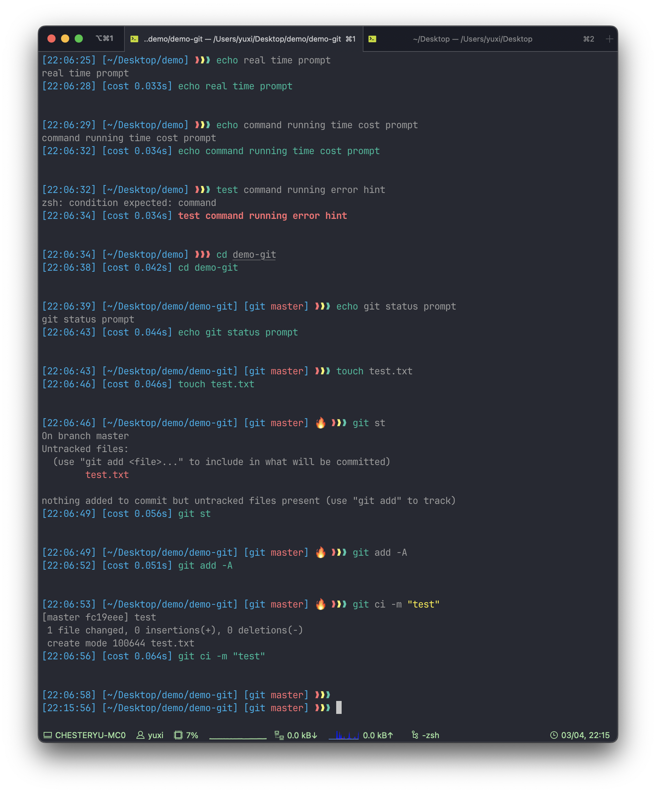
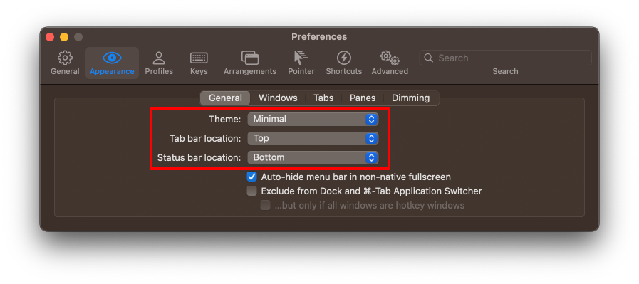

# simplerich-zsh-theme

## Overview

An oh-my-zsh theme;


### Feature

- Real Time Prompt
- Displays Command Running Time
- Command Execution Error Hint
- Rich Git Status

## Install

### Basic Install

1. Clone Repository:

```shell
git clone https://github.com/philip82148/simplerich-zsh-theme
```

2. Copy Theme:

```shell
cp ./simplerich-zsh-theme/simplerich.zsh-theme ~/.oh-my-zsh/themes/
```

3. Edit ~/.zshrc:

```shell:~/.zshrc
# Find the line that reads ZSH_THEME="..." and replace it with the following code.
ZSH_THEME="simplerich"
```

4. Load ~/.zshrc:

```shell
source ~/.zshrc
```

- See Also: [Overriding and adding themes](https://github.com/ohmyzsh/ohmyzsh/wiki/Customization#overriding-and-adding-themes);

## Trouble Shooting

### macOS, command not found: gdate

- simplerich.zsh-theme depends on cmd `gdate` to get current time in milliseconds. get `gdate` on macOS by running `brew install coreutils` then `source ~/.zshrc`;
- See Also: [#12](https://github.com/ChesterYue/ohmyzsh-theme-passion/issues/12);

### Linux, command not found: bc

- simplerich.zsh-theme depends on cmd `bc` to calculate the command running time cost. [get bc on Linux](https://www.tecmint.com/bc-command-examples/#:~:text=If%20you%20don%E2%80%99t%20have%20bc%20on%20your%20system%2C,command%20prompt%20and%20simply%20start%20calculating%20your%20expressions.) then `source ~/.zshrc`;
- see also: [#13](https://github.com/ChesterYue/ohmyzsh-theme-passion/issues/13);

### Centos 7, shell exit

- may caused by [set timer to zsh prompt](https://github.com/ChesterYue/ohmyzsh-theme-passion/blob/8f71c43c2df91810249ab00ff40fc4ca63207467/passion.zsh-theme#L197-L208);
- see also: [#4](https://github.com/ChesterYue/ohmyzsh-theme-passion/issues/4);

## Extra Preferences

### Zsh Plugins

1. [zsh-autosuggestions](https://github.com/zsh-users/zsh-autosuggestions);
2. [zsh-syntax-highlighting](https://github.com/zsh-users/zsh-syntax-highlighting);

### iTerm2 Preferences

#### Color

<!-- cspell:disable-next-line -->

- iTerm2: settings -> Profiles -> Colors -> Color Presets -> import `./simplerich.itermcolors` 
- alternate terminal: try [Alternate terminal installation and configuration](https://iterm2colorschemes.com/);

#### Status Bar

- iTerm2: settings -> Appearance && settings -> Profiles -> Session -> Configure Status Bar  

#### Font

- install [JetBrains Mono](https://www.jetbrains.com/lp/mono/);
- iTerm2: settings -> Appearance && settings -> Profiles -> Text -> Font 
