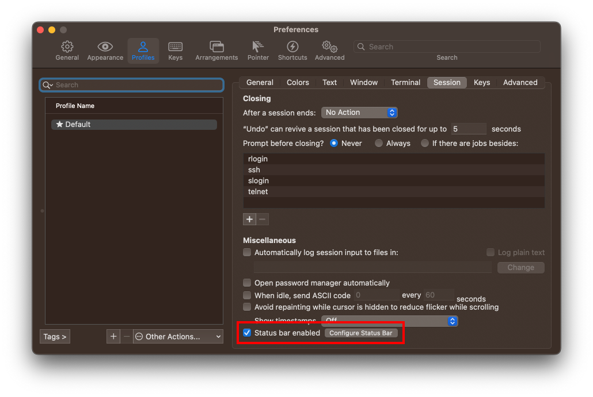

# simplerich-zsh-theme

## Overview

An oh-my-zsh theme.


### Features

You can see the followings at once:

- Real Time
- Login User
- Working Directory
- Anaconda's Environment Name
- Rich Git Status

After command execution, you can see also:

- Command Execution Time
- Success/Error Hint

## Install

1. Clone Repo & Copy Theme.

```shell
# cd path/to/where_u_want_to_clone_the_repo
git clone --recursive https://github.com/philip82148/simplerich-zsh-theme
cp ./simplerich-zsh-theme/simplerich.zsh-theme ~/.oh-my-zsh/themes/
```

2. Edit ~/.zshrc.

```shell
# file:~/.zshrc
# Find the line that reads ZSH_THEME="..." and replace it with the followings.
ZSH_THEME="simplerich"
source path/to/where_u_want_to_clone_the_repo/simplerich-zsh-theme/zsh-git-prompt/zshrc.sh
```

**Attention**

- These must be BEFORE the line `source $ZSH/oh-my-zsh.sh` in `~/.zshrc`.
- Change the path of `source .../zsh-git-prompt/zshrc.sh` according to your environment.
- If you comment out `source .../zsh-git-prompt/zshrc.sh` or you cannot use `python` command, you can use a simpler git status like the following:  
  

1. Load ~/.zshrc.

```shell
source ~/.zshrc
```

See Also: [Overriding and adding themes](https://github.com/ohmyzsh/ohmyzsh/wiki/Customization#overriding-and-adding-themes), [zsh-git-prompt](https://github.com/olivierverdier/zsh-git-prompt)

## Trouble Shooting

### On macOS, Command Not Found: gdate

- simplerich.zsh-theme depends on cmd `gdate` to get current time in milliseconds. get `gdate` on macOS by running `brew install coreutils` then `source ~/.zshrc`.
- See also [#12](https://github.com/ChesterYue/ohmyzsh-theme-passion/issues/12).

### On Linux, Command Not Found: bc

- simplerich.zsh-theme depends on cmd `bc` to calculate the command running time cost. [get bc on Linux](https://www.tecmint.com/bc-command-examples/#:~:text=If%20you%20don%E2%80%99t%20have%20bc%20on%20your%20system%2C,command%20prompt%20and%20simply%20start%20calculating%20your%20expressions.) then `source ~/.zshrc`.
- See also [#13](https://github.com/ChesterYue/ohmyzsh-theme-passion/issues/13).

### On Centos 7, Shell Exit

- It may be caused by [set timer to zsh prompt](https://github.com/ChesterYue/ohmyzsh-theme-passion/blob/8f71c43c2df91810249ab00ff40fc4ca63207467/passion.zsh-theme#L197-L208).
- See also [#4](https://github.com/ChesterYue/ohmyzsh-theme-passion/issues/4).

## Extra Preferences

### Zsh Plugins

1. [zsh-autosuggestions](https://github.com/zsh-users/zsh-autosuggestions)
2. [zsh-syntax-highlighting](https://github.com/zsh-users/zsh-syntax-highlighting)
3. [zsh-completions](https://github.com/zsh-users/zsh-completions)
4. [zsh-history-substring-search](https://github.com/zsh-users/zsh-history-substring-search)

### iTerm2 Preferences

#### Color

<!-- cspell:disable-next-line -->

- iTerm2: Settings -> Profiles -> Colors -> Color Presets -> Import `./simplerich.itermcolors`
  
- Alternate terminal: Try [Alternate terminal installation and configuration](https://iterm2colorschemes.com/).

#### Status Bar

- iTerm2: Settings -> Appearance && settings -> Profiles -> Session -> Configure Status Bar
   

#### Font

- Install [JetBrains Mono](https://www.jetbrains.com/lp/mono/).
- iTerm2: Settings -> Appearance && settings -> Profiles -> Text -> Font
  
